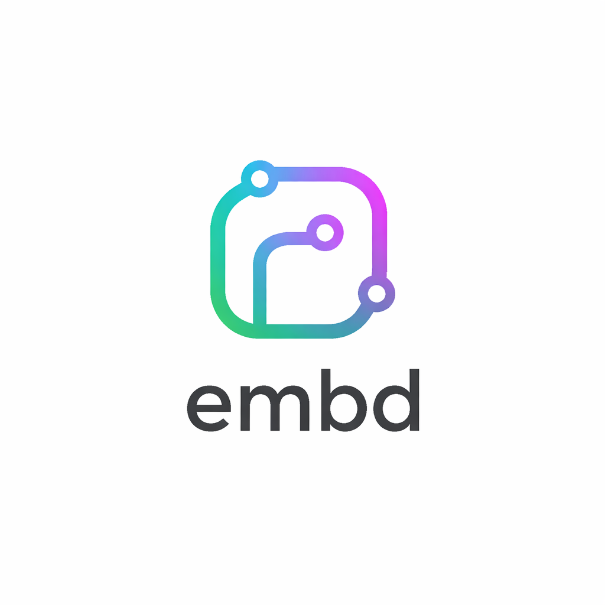

<p align="center">
  
</p>

<h1 align="center">embd</h1>

<p align="center">
  A lightweight, GPU-accelerated code editor built entirely in Rust.
  <br />
  Powered by <a href="https://gpui.rs">GPUI</a> — the same framework behind <a href="https://zed.dev">Zed</a>.
</p>

<p align="center">
  <a href="https://github.com/chewton2k/embd-ide/releases">Download</a> &nbsp;&middot;&nbsp;
  <a href="#build-from-source">Build from Source</a> &nbsp;&middot;&nbsp;
  <a href="#features">Features</a>
</p>

---

## Features

- **Syntax-highlighted editor** with line numbers and language detection
- **File explorer** with tree view and git status indicators
- **Integrated terminal** with multiple sessions (vt100)
- **Git panel** — branch, staged/changed files, diff preview
- **Fuzzy file search** — quick-open any file
- **Resizable panels** — drag to resize sidebar, editor, terminal, and git
- **Cross-platform** — macOS, Linux, and Windows

## Install

### Download

Grab the latest release for your platform from [Releases](https://github.com/chewton2k/embd-ide/releases/latest):

| Platform | Download |
|---|---|
| macOS (Apple Silicon) | `embd-aarch64-apple-darwin.zip` |
| macOS (Intel) | `embd-x86_64-apple-darwin.zip` |
| Linux (x86_64) | `embd-x86_64-unknown-linux-gnu.tar.gz` |
| Windows (x86_64) | `embd-x86_64-pc-windows-msvc.zip` |

**macOS** — Unzip and drag `embd.app` into `/Applications`.

**Linux** — Extract and copy the binary:
```bash
tar xzf embd-x86_64-unknown-linux-gnu.tar.gz
sudo cp embd-x86_64-unknown-linux-gnu/embd /usr/local/bin/
sudo cp embd-x86_64-unknown-linux-gnu/embd.desktop /usr/share/applications/
```

**Windows** — Unzip and add `embd.exe` to your PATH.

---

### Build from Source

#### Prerequisites

<details>
<summary><strong>macOS</strong></summary>

```bash
xcode-select --install
curl --proto '=https' --tlsv1.2 -sSf https://sh.rustup.rs | sh
```

</details>

<details>
<summary><strong>Linux (Ubuntu/Debian)</strong></summary>

```bash
curl --proto '=https' --tlsv1.2 -sSf https://sh.rustup.rs | sh
sudo apt-get install -y build-essential cmake libvulkan-dev libwayland-dev \
  libxkbcommon-dev libxkbcommon-x11-dev libx11-dev libxcb1-dev \
  libfontconfig-dev libfreetype-dev libssl-dev pkg-config
```

</details>

<details>
<summary><strong>Windows</strong></summary>

Install [Rust](https://rustup.rs) and the [Visual Studio C++ Build Tools](https://visualstudio.microsoft.com/visual-cpp-build-tools/).

</details>

#### Building

```bash
git clone https://github.com/chewton2k/embd-ide.git
cd embd-ide
```

For a debug build:

```bash
cargo run
```

For a release build:

```bash
cargo run --release
```

To bundle and install for your platform:

```bash
cargo xtask install
```

#### All commands

| Command | Description |
|---|---|
| `cargo run` | Run in development mode |
| `cargo run --release` | Run optimized release build |
| `cargo xtask bundle` | Build a release bundle for your platform |
| `cargo xtask install` | Build + install to the system |
| `cargo xtask clean` | Clean all build artifacts |

## Keyboard Shortcuts

| Shortcut | Action |
|---|---|
| `Cmd+O` | Open folder |
| `Cmd+P` | Search files |
| `Cmd+B` | Toggle sidebar |
| `Cmd+J` | Toggle terminal |
| `Cmd+G` | Toggle git panel |
| `Cmd+S` | Save file |
| `Cmd+W` | Close tab |
| `Ctrl+Tab` | Next tab |
| `Ctrl+Shift+Tab` | Previous tab |
| `Cmd+Q` | Quit |

## Project Structure

```
crates/
  embd-app/        Main application — UI, window, panels
  embd-core/       Shared types, error handling, event primitives
  embd-editor/     Editor core — rope buffer, cursors, undo/redo
  embd-workspace/  Workspace model — project, file tree, tabs, sessions
  embd-platform/   Platform services — filesystem, git, search
  embd-commands/   Command registry and action dispatch
  xtask/           Build tasks — bundle, install, clean
```

## Troubleshooting

**macOS: Error compiling metal shaders**
```
xcrun: error: unable to find utility "metal"
```
Run `sudo xcode-select --switch /Applications/Xcode.app/Contents/Developer`

**Linux: Missing Vulkan/Wayland headers**

Install the system dependencies listed in the [Linux prerequisites](#prerequisites).

**Cargo errors about unstable features**

Run `cargo clean` then `cargo run`.

## Feedback

Bug reports and suggestions: [feedback form](https://docs.google.com/forms/d/e/1FAIpQLSe1Dsog4TyfOHtNnQaMMKLqfcnWlTFNW2U9RcAnF-E5PB_NCw/viewform?usp=publish-editor)
